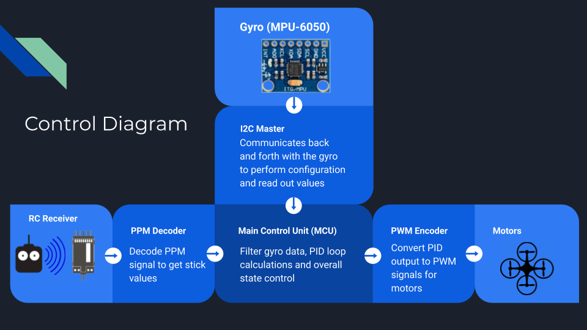

# FPGA Flight Controller

This was my final project for CS 429H Computer Architecture (freshman year fall, UT Austin).
Done in collaboration with [William Wang](https://github.com/wwang0) and [Andrew Nolte](https://github.com/AndrewNolte).

## Our Project

In this project, we designed a flight controller (FC) module in SystemVerilog to fly a quadcopter. We deployed our code
to an Altera Cyclone II FPGA development board and installed the board on the quadcopter, along with other necessary hardware. We tuned
the flight parameters to achieve stable flight using a radio transmitter.

## Background

Control of a quadcopter begins with the radio receiver, which captures stick values from the radio transmitter used to
fly the drone. These values are interpreted as "intended" angular velocities for the drone about the three coordinate
axes. Inside the FC, a control loop compares the intended velocities to the actual velocities reported by an onboard
gyroscope module. Finally, it calculates what motor power setting would most quickly correct the error and communicates
the result to the motors.

## Block Diagram

## PPM Decoder (`ppm_decoder.sv`)

The `ppm_decoder` submodule is used to interpret the [pulse position modulation (PPM)](https://en.wikipedia.org/wiki/Pulse-position_modulation) signal provided by the radio
receiver. This signal contains six channels, one for each "axis" of the transmitter control sticks. We decode this
signal by setting a counter-timer and measuring the intervals between rising edges of the PPM signal. These intervals
are then manipulated and written out to the appropriate channels in the module's output, which are determined using a
finite-state model of PPM channel transmission.

## Gyroscope Communication (`i2c_master.sv`, `mpu6050_driver.sv`, `lpf.sv`)

The `i2c_master` submodule implements a generic [I2C](https://en.wikipedia.org/wiki/I%C2%B2C) master that accepts a variety of read/write commands to any slave and reports what state it is
in. It supports variable frequencies as well as handles clock stretching by the slave. The `mpu6050_driver` submodule
leverages the `i2c_master` submodule to communicate with the actual MPU6050 gyroscope. On boot, it performs necessary configuration to the MPU6050 registers,
and then begins outputting the gyroscope readings in an infinite loop. Finally, these values are fed into the low-pass
filter module that uses an exponential moving average to filter out high-frequency noise.

## PID Control Loop (`pid.sv`)

[PID control](https://en.wikipedia.org/wiki/PID_controller) is a classic control algorithm for computing a response value from a setpoint and a sensor value. 
We have 3 PID loops, one for each of the roll, pitch, and yaw axes. On each axis, the setpoints are angular velocities derived from the radio transmitter signal,
and the sensor values are filtered angular velocity readings from the gyroscope.
Those 3 response values are then added together according to a motor-mixing scheme that will stabilize the quadcopter. Throttle is added to each of the motors
separately at the end.

In our calculations, we decided to normalize both setpoints and sensor values into degrees per second in order to make better guesses at initial PID values.
We also square the radio transmitter inputs before normalization in order to add sensitivity to the lower ranges.
The actual hardware implementation uses fixed-point arithmetic with 10 or more bits of precision.

## PWM Encoder (`pwm_encoder.sv`)

Once the desired motor power settings are calculated, they must be transmitted to the motors. This can be done using a
variety of protocols, the most straightforward of which is [pulse width modulation (PWM)](https://en.wikipedia.org/wiki/Pulse-width_modulation). PWM is encoded by pulling all
motor control wires high on a regular interval, then pulling them low after time intervals proportional to the desired
power value. In hardware, this is accomplished using a resettable counter, which is compared against at every clock tick
to determine if a wire should be pulled low. When the counter reaches a critical value, all wires are pulled high again.

## Report

### What worked?

Debugging hardware by observing signals in oscilloscope, verifying HDL logic using simulation
before deploying it, integrating general signal processing techniques (EMA lowpass filter) to eliminate jitter,
using principled PID tuning methods (Ziegler-Nichols method).

### What didn't work?

Tuning PID by guessing didn't work very well at all, since we had little idea where to start.
Also, getting the drone completely stable proved to be almost impossible - we were never able
to get the last bit of jitter or drift out of the system.

### What did you learn?

Many more features of Verilog and SystemVerilog, finite-state modeling
of physical and virtual systems, various communication protocols (I2C, PPM, PWM),
open drain and push-pull pins, signal processing techniques, PID control and tuning.

Also, the importance of verifying the logic of HDL code using simulation tools before deploying it,
because debugging hardware in the real world is extremely difficult.

### What was the relative contribution of each team member

- Kevin: I2C master (`i2c_master.sv`), gyro communication (`mpu6050_driver.sv`), low-pass filter (`lpf.sv`)
- William: RX communication (`ppm_decoder.sv`), motor communication (`pwm_encoder.sv`), soldering
- Andrew: designed motor mixing and PID algorithms (`pid.sv`)
- All worked on: top-level module (`main.sv`), tuning of PID values, presentations, overall design
